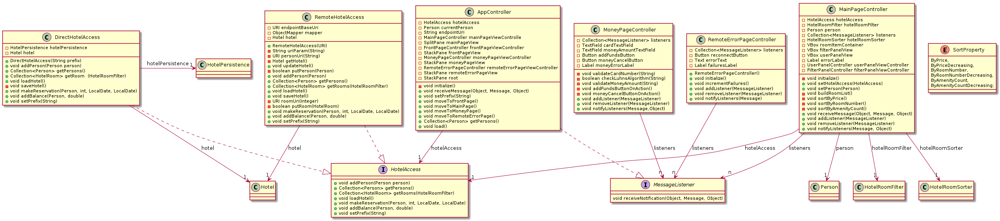
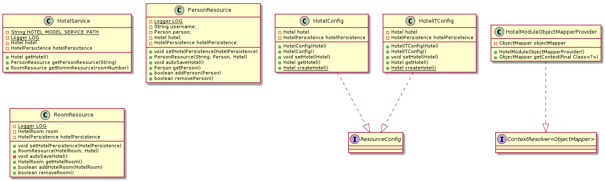

# Moduler
Prosjektet inneholder flere moduler, disse modulene er

* __core__ - hovedlogikk for HotelSys. 
* __ui__ - det grafiske brukergrensesnittet.
* __persistence__ - lagring og lasting fra fil.
* __RESTservice__ - oppkobling mott REST api.

I denne mappen ligger det flere markdown-filer, som inneholder kode for å
generere klassediagrammer med PlantUML. Disse kan man også se under [images](../images).

## core

## ui

Klassediagrammet for UI er delt i to, for at det skal være mer oversiktlig.

## persistence

## RESTserver

