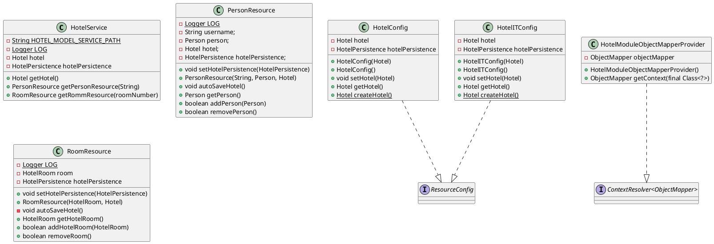

```plantuml
@startuml

class HotelService {
    - {static} String HOTEL_MODEL_SERVICE_PATH
    - {static} Logger LOG
    - Hotel hotel
    - HotelPersictence hotelPersictence 

    + Hotel getHotel()
    + PersonResource getPersonResource(String)
    + RoomResource getRommResource(roomNumber)
}

class PersonResource {
    - {static} Logger LOG 
    - String username;
    - Person person;
    - Hotel hotel;
    - HotelPersistence hotelPersistence;

    + void setHotelPersistence(HotelPersistence)
    + PersonResource(String, Person, Hotel)
    + void autoSaveHotel() 
    + Person getPerson()
    + boolean addPerson(Person) 
    + boolean removePerson()
}

class RoomResource{
    - {static} Logger LOG
    - HotelRoom room
    - HotelPersistence hotelPersistence

    + void setHotelPersistence(HotelPersistence)
    + RoomResource(HotelRoom, Hotel)
    - void autoSaveHotel()
    + HotelRoom getHotelRoom()
    + boolean addHotelRoom(HotelRoom)
    + boolean removeRoom()
}

class HotelConfig{
    - Hotel hotel
    - HotelPersistence hotelPersistence
    
    + HotelConfig(Hotel)
    + HotelConfig() 
    + void setHotel(Hotel)
    + Hotel getHotel()
    + {static} Hotel createHotel()
}

class HotelITConfig{
    - Hotel hotel
    - HotelPersistence hotelPersistence

    + HotelITConfig(Hotel)
    + HotelITConfig()
    + void setHotel(Hotel)
    + Hotel getHotel()
    + {static} Hotel createHotel()
}

class HotelModuleObjectMapperProvider{
    - ObjectMapper objectMapper
    + HotelModuleObjectMapperProvider()
    + ObjectMapper getContext(final Class<?>)
}

interface "ResourceConfig"{
}

interface "ContextResolver<ObjectMapper>"{ 
}

HotelConfig ..|> "ResourceConfig"
HotelITConfig ..|> "ResourceConfig"
HotelModuleObjectMapperProvider ..|> "ContextResolver<ObjectMapper>"

@enduml
```
