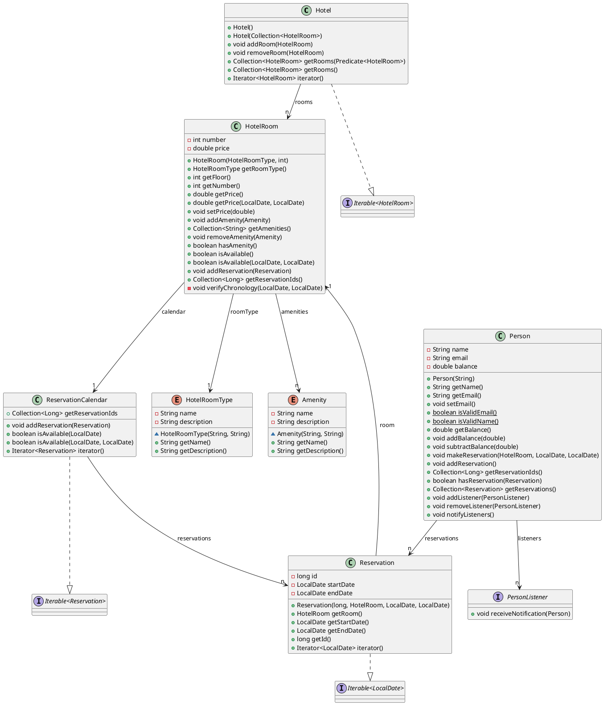

```plantuml
@startuml
' defining all the classes in core module
class Hotel {
    +Hotel()
    +Hotel(Collection<HotelRoom>)
    +void addRoom(HotelRoom)
    +void removeRoom(HotelRoom)
    +Collection<HotelRoom> getRooms(Predicate<HotelRoom>)
    +Collection<HotelRoom> getRooms()
    +Iterator<HotelRoom> iterator()
}

class HotelRoom {
    - int number
    - double price

    + HotelRoom(HotelRoomType, int)
    + HotelRoomType getRoomType()
    + int getFloor()
    + int getNumber()
    + double getPrice()
    + double getPrice(LocalDate, LocalDate)
    + void setPrice(double)
    + void addAmenity(Amenity)
    + Collection<String> getAmenities()
    + void removeAmenity(Amenity)
    + boolean hasAmenity()
    + boolean isAvailable()
    + boolean isAvailable(LocalDate, LocalDate)
    + void addReservation(Reservation)
    + Collection<Long> getReservationIds()
    - void verifyChronology(LocalDate, LocalDate)
}

class ReservationCalendar {
    + void addReservation(Reservation)
    + Collection<Long> getReservationIds
    + boolean isAvailable(LocalDate)
    + boolean isAvailable(LocalDate, LocalDate)
    + Iterator<Reservation> iterator()
}

class Reservation {
    - long id
    - LocalDate startDate
    - LocalDate endDate
    
    + Reservation(long, HotelRoom, LocalDate, LocalDate)
    + HotelRoom getRoom()
    + LocalDate getStartDate()
    + LocalDate getEndDate()
    + long getId()
    + Iterator<LocalDate> iterator()
}

class Person {
    - String name
    - String email
    - double balance

    + Person(String)
    + String getName()
    + String getEmail()
    + void setEmail()
    + {static} boolean isValidEmail()
    + {static} boolean isValidName()
    + double getBalance()
    + void addBalance(double)
    + void subtractBalance(double)
    + void makeReservation(HotelRoom, LocalDate, LocalDate)
    + void addReservation()
    + Collection<Long> getReservationIds()
    + boolean hasReservation(Reservation)
    + Collection<Reservation> getReservations()
    + void addListener(PersonListener)
    + void removeListener(PersonListener)
    + void notifyListeners()


}

interface PersonListener {
    + void receiveNotification(Person)
}
interface "Iterable<Reservation>" {
}

interface "Iterable<HotelRoom>" {
}

interface "Iterable<LocalDate>" {
}

enum HotelRoomType {
    - String name
    - String description
    ~ HotelRoomType(String, String)
    + String getName()
    + String getDescription()
}

enum Amenity {
    - String name
    - String description

    ~ Amenity(String, String)
    + String getName()
    + String getDescription()
}
' defining the relations
Hotel --> "n" HotelRoom : rooms
Hotel ..|> "Iterable<HotelRoom>"
HotelRoom --> "n" Amenity : amenities
HotelRoom --> "1" HotelRoomType : roomType
HotelRoom --> "1" ReservationCalendar : calendar
ReservationCalendar --> "n" Reservation : reservations
ReservationCalendar ..|> "Iterable<Reservation>"
Reservation ..|> "Iterable<LocalDate>"
Reservation --> "1" HotelRoom : room
Person --> "n" PersonListener : listeners
Person --> "n" Reservation : reservations


@enduml
```

