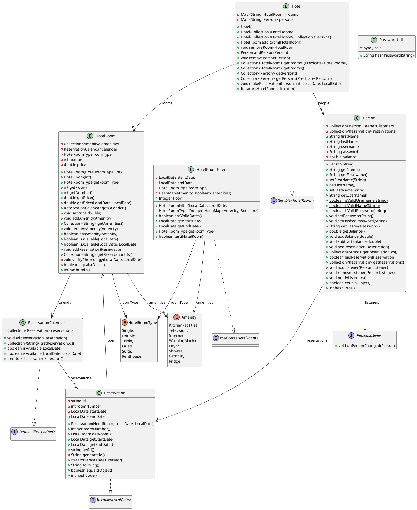

```plantuml
@startuml
' defining all the classes in core module
class Hotel {
    - Map<String, HotelRoom> rooms
    - Map<String, Person> persons

    + Hotel()
    + Hotel(Collection<HotelRoom>)
    + Hotel(Collection<HotelRoom>, Collection<Person>)
    + HotelRoom addRoom(HotelRoom)
    + void removeRoom(HotelRoom)
    + Person addPerson(Person) 
    + void removePerson(Person)
    + Collection<HotelRoom> getRooms  (Predicate<HotelRoom>)
    + Collection<HotelRoom> getRooms()
    + Collection<Person> getPersons()
    + Collection<Person> getPersons(Predicate<Person>)
    + void makeReservation(Person, int, LocalDate, LocalDate)
    + Iterator<HotelRoom> iterator()
}

class HotelRoom {
    - Collection<Amenity> amenities 
    - ReservationCalendar calendar
    - HotelRoomType roomType
    - int number
    - double price

    + HotelRoom(HotelRoomType, int)
    + HotelRoom(int)
    + HotelRoomType getRoomType()
    + int getFloor()
    + int getNumber()
    + double getPrice()
    + double getPrice(LocalDate, LocalDate)
    + ReservationCalendar getCalendar()
    + void setPrice(double)
    + void addAmenity(Amenity)
    + Collection<String> getAmenities()
    + void removeAmenity(Amenity)
    + boolean hasAmenity(Amenity)
    + boolean isAvailable(LocalDate)
    + boolean isAvailable(LocalDate, LocalDate)
    + void addReservation(Reservation)
    + Collection<String> getReservationIds()
    - void verifyChronology(LocalDate, LocalDate)
    + boolean equals(Object)
    + int hashCode()
}

class HotelRoomFilter{
    - LocalDate startDate;
    - LocalDate endDate;
    - HotelRoomType roomType;
    - HashMap<Amenity, Boolean> amenities;
    - Integer floor;

    + HotelRoomFilter(LocalDate, LocalDate, 
    HotelRoomType, Integer, HashMap<Amenity, Boolean>)
    + boolean hasValidDates()
    + LocalDate getStartDate()
    + LocalDate getEndDate()
    + HotelRoomType getRoomType()
    + boolean test(HotelRoom) 
}

class PasswordUtil{
    - {static} byte[] salt

    + {static} String hashPassword(String)
}

class ReservationCalendar {
    - Collection<Reservation> reservations

    + void addReservation(Reservation)
    + Collection<String> getReservationIds()
    + boolean isAvailable(LocalDate)
    + boolean isAvailable(LocalDate, LocalDate)
    + Iterator<Reservation> iterator()
}

class Reservation {
    - string id
    - int roomNumber
    - LocalDate startDate
    - LocalDate endDate
    
    + Reservation(HotelRoom, LocalDate, LocalDate)
    + int getRoomNumber()
    + HotelRoom getRoom()
    + LocalDate getStartDate()
    + LocalDate getEndDate()
    + string getId()
    - String generateId()
    + Iterator<LocalDate> iterator()
    + String toString()
    + boolean equals(Object)
    + int hashCode() 
}

class Person {
    - Collection<PersonListener> listeners
    - Collection<Reservation> reservations
    - String firstName
    - String lastName
    - String username
    - String password
    - double balance

    + Person(String)
    + String getName()
    + String getFirstName()
    + setFirstName(String)
    + getLastName()
    + setLastName(String)
    + String getUsername()
    + {static} boolean isValidUsername(String)
    + {static} boolean isValidName(String)
    + {static} boolean isValidPassword(string)
    + void setPassword(String)
    + void setHashedPassword(String)
    + String getHashedPassword()
    + double getBalance()
    + void addBalance(double)
    + void subtractBalance(double)
    + void addReservation(Reservation)
    + Collection<String> getReservationIds()
    + boolean hasReservation(Reservation)
    + Collection<Reservation> getReservations()
    + void addListener(PersonListener)
    + void removeListener(PersonListener)
    + void notifyListeners()
    + boolean equals(Object)
    + int hashCode()
}

interface PersonListener {
    + void onPersonChanged(Person)
}
interface "Iterable<Reservation>" {
}

interface "Iterable<HotelRoom>" {
}

interface "Iterable<LocalDate>" {
}

interface "Predicate<HotelRoom>"{
}

enum HotelRoomType {
    Single,
    Double,
    Triple,
    Quad,
    Suite,
    Penthouse
}

enum Amenity {
    KitchenFacilities,
    Television,
    Internet,
    WashingMachine,
    Dryer,
    Shower,
    Bathtub,
    Fridge
}
' defining the relations
Hotel --> "n" HotelRoom : rooms
Hotel --> "n" Person: people
Hotel ..|> "Iterable<HotelRoom>"
HotelRoom --> "n" Amenity : amenities
HotelRoom --> "1" HotelRoomType : roomType
HotelRoom --> "1" ReservationCalendar : calendar
HotelRoomFilter --> "1" HotelRoomType : roomType
HotelRoomFilter --> "n" Amenity : amenities
HotelRoomFilter ..|> "Predicate<HotelRoom>"
ReservationCalendar --> "n" Reservation : reservations
ReservationCalendar ..|> "Iterable<Reservation>"
Reservation ..|> "Iterable<LocalDate>"
Reservation --> "1" HotelRoom : room
Person --> "n" PersonListener : listeners
Person --> "n" Reservation : reservations


@enduml
```

