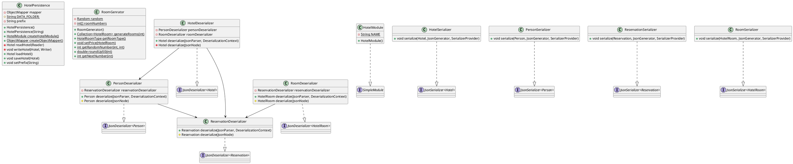

```plantuml
@startuml

class HotelPersistence{
    - ObjectMapper mapper
    # {static} String DATA_FOLDER; 
    - String prefix

    + HotelPersistence()
    + HotelPersistence(String)
    + {static} HotelModule createHotelModule()
    + {static} ObjectMapper createObjectMapper()
    - Hotel readHotel(Reader)
    - void writeHotel(Hotel, Writer)
    + Hotel loadHotel() 
    + void saveHotel(Hotel)
    + void setPrefix(String)
}

class RoomGenrator {
    - {static} Random random
    - {static} int[] roomNumbers

    + RoomGenerator()
    + {static} Collection<HotelRoom> generateRooms(int)
    + {static} HotelRoomType getRoomType()
    + {static} void setPrice(HotelRoom) 
    + {static} int getRandomNumber(int, int)
    + {static} double roundUp50(int)
    + {static} int getNextNumber(int)
}

class HotelDeserializer {
    - PersonDeserializer personDeserializer
    - RoomDeserializer roomDeserializer

    + Hotel deserialize(JsonParser, DeserializationContext)
    - Hotel deserialize(JsonNode) 
}

class HotelModule{
    - {static} String NAME

    + HotelModule()
}

class HotelSerializer{
    + void serialize(Hotel, JsonGenerator, SerializerProvider)
}

class PersonDeserializer{
    - ReservationDeserializer reservationDeserializer

    + Person deserialize(JsonParser, DeserializationContext)
    # Person deserialize(JsonNode) 
}

class PersonSerializer{
    + void serialize(Person, JsonGenerator, SerializerProvider)
}

class ReservationDeserializer{
    + Reservation deserialize(JsonParser, DeserializationContext)
    # Reservation deserialize(JsonNode)
}

class ReservationSerializer{
    + void serialize(Reservation, JsonGenerator, SerializerProvider)
}

class RoomDeserializer{
    - ReservationDeserializer reservationDeserializer

    + HotelRoom deserialize(JsonParser, DeserializationContext)
    # HotelRoom deserialize(JsonNode)
}

class RoomSerializer{
    + void serialize(HotelRoom, JsonGenerator, SerializerProvider)
}

interface "JsonDeserializer<Hotel>"{
}
interface "SimpleModule"{
}
interface "JsonSerializer<Hotel>"{
}
interface "JsonDeserializer<Person>"{
}
interface "JsonSerializer<Person>"{
}
interface "JsonDeserializer<Reservation>"{
}
interface "JsonSerializer<Reservation>"{
}
interface "JsonDeserializer<HotelRoom>"{
}
interface "JsonSerializer<HotelRoom>"{
}

HotelDeserializer ..|> "JsonDeserializer<Hotel>"
HotelModule ..|> "SimpleModule"
HotelSerializer ..|> "JsonSerializer<Hotel>"
PersonDeserializer ..|> "JsonDeserializer<Person>"
PersonSerializer ..|> "JsonSerializer<Person>"
ReservationDeserializer ..|> "JsonDeserializer<Reservation>"
ReservationSerializer ..|> "JsonSerializer<Reservation>"
RoomDeserializer ..|> "JsonDeserializer<HotelRoom>"
RoomSerializer ..|> "JsonSerializer<HotelRoom>"

RoomDeserializer --> ReservationDeserializer
PersonDeserializer --> ReservationDeserializer
HotelDeserializer --> PersonDeserializer
HotelDeserializer --> ReservationDeserializer

@enduml
```