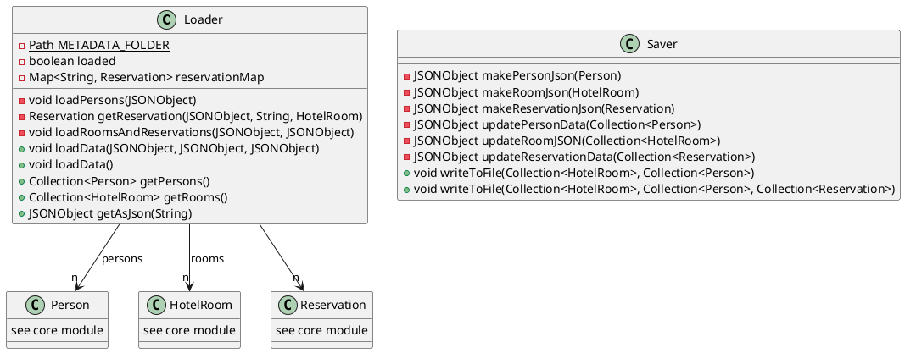

```plantuml
@startuml
class Loader {
    - {static} Path METADATA_FOLDER
    - boolean loaded
    - Map<String, Reservation> reservationMap
    - void loadPersons(JSONObject)
    - Reservation getReservation(JSONObject, String, HotelRoom)
    - void loadRoomsAndReservations(JSONObject, JSONObject)
    + void loadData(JSONObject, JSONObject, JSONObject)
    + void loadData()
    + Collection<Person> getPersons()
    + Collection<HotelRoom> getRooms()
    + JSONObject getAsJson(String)
}

class Saver {
    - JSONObject makePersonJson(Person)
    - JSONObject makeRoomJson(HotelRoom)
    - JSONObject makeReservationJson(Reservation)
    - JSONObject updatePersonData(Collection<Person>)
    - JSONObject updateRoomJSON(Collection<HotelRoom>)
    - JSONObject updateReservationData(Collection<Reservation>)
    + void writeToFile(Collection<HotelRoom>, Collection<Person>)
    + void writeToFile(Collection<HotelRoom>, Collection<Person>, Collection<Reservation>)
}

class Person {
    see core module
}

class HotelRoom {
    see core module
}

class Reservation {
    see core module
}

Loader --> "n" Person : persons
Loader --> "n" HotelRoom : rooms
Loader --> "n" Reservation
@enduml
```