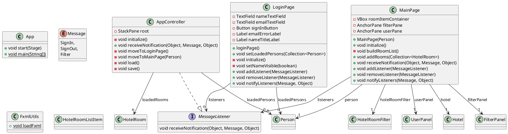

```plantuml
@startuml
class App {
    + void start(Stage)
    + {static} void main(String[])
}

class AppController {
    - StackPane root

    - void initialize()
    + void receiveNotification(Object, Message, Object)
    - void moveToLoginPage()
    - void moveToMainPage(Person)
    - void load()
    - void save()
}

enum Message {
    SignIn,
    SignOut,
    Filter
}

class FxmlUtils {
    + {static} void loadFxml
}

class LoginPage {
    - TextField nameTextField
    - TextField emailTextField
    - Button signInButton
    - Label emailErrorLabel
    - Label nameTitleLabel

    + loginPage()
    + void setLoadedPersons(Collection<Person>)
    - void initialize()
    - void setNameVisible(boolean)
    + void addListener(MessageListener)
    + void removeListener(MessageListener)
    + void notifyListeners(Message, Object)

}

class MainPage {
    - VBox roomItemContainer
    - AnchorPane filterPane
    - AnchorPane userPane
    + MainPage(Person)
    + void initialize()
    - void buildRoomList()
    + void addRooms(Collection<HotelRoom>)
    + void receiveNotification(Object, Message, Object)
    + void addListener(MessageListener)
    + void removeListener(MessageListener)
    + void notifyListeners(Message, Object)
}

class FilterPanel {

}

class HotelRoomFilter {

}

class HotelRoomListItem {

}

class UserPanel {

}
interface MessageListener {
    void receiveNotification(Object, Message, Object)
}
class Person
class HotelRoom
class Hotel

AppController ..|> MessageListener
AppController --> "n" Person : loadedPersons
AppController --> "n" HotelRoom : loadedRooms
LoginPage --> "n" MessageListener : listeners
LoginPage --> "n" Person : loadedPersons
MainPage --> "1" FilterPanel : filterPanel
MainPage --> "1" UserPanel : userPanel
MainPage --> "1" Hotel : hotel
MainPage --> "1" HotelRoomFilter : hotelRoomFilter
MainPage --> "1" Person : person
MainPage --> "n" MessageListener : listeners

@enduml
```