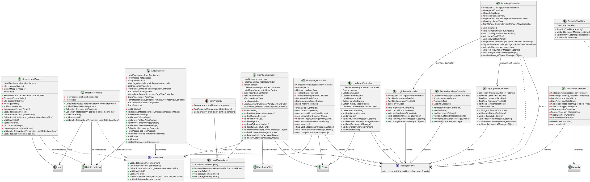

```plantuml
@startuml
class DirectHotelAccess {
    - HotelPersistence hotelPersistence
    - Hotel hotel

    + DirectHotelAccess(HotelPersistence hotelPersistence)
    + void addPerson(Person person)
    + Collection<Person> getPersons()
    + Collection<HotelRoom> getRoom  (HotelRoomFilter)
    + void loadHotel()
    + void saveHotel()
    + void makeReservation(Person, int, LocalDate, LocalDate)
}

class RemoteHotelAccess {
    - HotelPersistence hotelPersistence
    - URI endpointBaseUri
    - ObjectMapper mapper
    - Hotel hotel

    + RemoteHotelAccess(HotelPersistence, URI)
    - String uriParam(String)
    - URI personUri(String)
    - Hotel getHotel()
    + void updateHotel()
    - boolean putPerson(Person)
    + void addPerson(Person)
    + Collection<Person> getPersons()
    + Collection<HotelRoom> getRooms(HotelRoomFilter)
    + void loadHotel()
    + void saveHotel()
    - URI roomUri(Integer)
    - boolean putRoom(HotelRoom)
    + void makeReservation(Person, int, LocalDate, LocalDate)
    + void addBalance(Person, double) 
}

class App {
    + void start(Stage)
    + {static} void main(String[])
}

class RemoteApp {
    + void start(Stage) 
    + void main(String[])
}

class AppController {
    - HotelPersistence hotelPersistence
    - HotelAccess hotelAccess
    - String endpointUri
    - MainPageController mainPageViewControlle
    - SplitPane mainPageView
    - FrontPageController frontPageViewController
    - StackPane frontPageView
    - MoneyPageController moneyPageViewController
    - StackPane moneyPageView
    - RemoteErrorPageController remoteErrorPageViewController
    - StackPane remoteErrorPageView
    - StackPane root

    - void initialize()
    + void receiveMessage(Object, Message message,Object)
    + void setPrefix(String)
    + void moveToFrontPage()
    + void moveToMainPage(Person)
    + void moveToMoneyPage(Person)
    + void moveToRemoteErrorPage()
    + Collection<Person> getPersons()
    + HotelAccess getHotelAccess()
    + HotelPersistence getHotelPersistence()
    + void load()
    + void save()
    + void setHotelAccess(HotelAccess)
}

class FrontPageController {
    - Collection<MessageListener> listeners 
    - VBox panelContainer
    - VBox defaultPanel
    - VBox signUpPanelView
    - LoginPanelController loginPanelViewController
    - VBox loginPanelView
    - SignUpPanelController signUpPanelViewController

    - void initialize()
    - void startLoginButtonOnAction()
    - void startSignUpButtonOnAction() 
    - void showPanel(VBox)
    + void showDefaultPanel()
    + LoginPanelController getLoginPanelViewController()
    + SignUpPanelController getSignUpPanelViewController()
    + void addListener(MessageListener)
    + void removeListener(MessageListener)
    + void notifyListeners(Message,Object)
    + receiveMessage(Object, Message, Object)
}

class LoginPanelController {
    - Collection<MessageListener> listeners
    - TextField usernameTextField
    - TextField passwordTextField
    - Label errorLabel

    - void loginButtonOnAction() 
    - void cancelButtonOnAction()
    + void setErrorLabel(String text)
    + void addListener(MessageListener)
    + void removeListener(MessageListener)
    + void notifyListeners(Message, Object)
}

class SignUpPanelController {
    - Collection<MessageListener> listeners
    - TextField usernameTextField
    - TextField passwordTextField
    - TextField firstNameTextField
    - TextField lastNameTextField
    - Label errorLabel

    - void signUpButtonOnAction()
    - void cancelButtonOnAction()
    + void setErrorLabel(String)
    + void addListener(MessageListener)
    + void removeListener(MessageListener)
    + void notifyListeners(Message, Object)
}

class FilterPanelController {
    - Collection<MessageListener> listeners
    - HashMap<Amenity, Boolean> amenities
    - DatePicker startDatePicker
    - DatePicker endDatePicker
    - ChoiceBox<HotelRoomType> roomTypeChoiceBox
    - Label roomTypeDescription
    - VBox amenitiesContainer
    - Spinner<Integer> floorSpinner
    - CheckBox floorCheckBox
    - Button clearFilterButton

    + FilterPanelController()
    - void initialize()
    }

class AmenityCheckBox {
    - CheckBox checkBox 
    
    + AmenityCheckBox(Amenity)
    + void addListener(MessageListener)
    + void removeListener(MessageListener)
    + void notifyListeners()
}

class HotelRoomListItem {
    - HotelRoom room
    - Label numberLabel
    - Label typeLabel
    - Label amenitiesLabel
    - Label pricePerNightLabel
    - Label totalPriceLabel
    - Label totalPriceTextLabel
    - Label errorLabel
    - Button makeReservationButton

    + HotelRoomListItem(HotelRoom)
    - void initialize() 
    + void setTotalPriceLabel(String)
    + void setErrorLabel(String)
    + void setOnMakeReservationButtonAction(EventHandler<ActionEvent>)
}

class HotelRoomSorter {
    - SortProperty sortProperty
    
    + List<HotelRoom> sortRooms(Collection<HotelRoom>)
    + void sortByPrice()
    + void sortByRoomNumber()
    + void sortByAmenityCount()
}

class MainPageController {
    - HotelAccess hotelAccess
    -  HotelRoomFilter hotelRoomFilter
    - Person person
    - Collection<MessageListener> listeners
    - HotelRoomSorter hotelRoomSorter
    - VBox roomItemContainer
    - VBox filterPanelView
    - VBox userPanelView
    - Label errorLabel
    - UserPanelController userPanelViewController
    - FilterPanelController filterPanelViewController

    - void initialize()
    + void setHotelAccess(HotelAccess)
    + void setPerson(Person)
    - void buildRoomList()
    - void sortByPrice()
    - void sortByRoomNumber() 
    - void sortByAmenityCount() 
    + void receiveMessage(Object, Message, Object)
    + void addListener(MessageListener)
    + void removeListener(MessageListener)
    + void notifyListeners(Message, Object) 
}

class UserPanelController {
    - Collection<MessageListener> listeners
    - Person person
    - Label nameLabel
    - Label usernameLabel
    - Label balanceLabel
    - Button signOutButton
    - Button makeDepositButton
    - ListView<Label> reservationListView

    + UserPanelController() 
    + void setPerson(Person)
    - void initialize()
    + void addListener(MessageListener)
    + void removeListener(MessageListener)
    + void notifyListeners(Message)
    + void onPersonChanged(Person)
    - void updatePanel()
}

class MoneyPageController {
    - Collection<MessageListener> listeners
    - Person person
    - HotelAccess hotelAccess
    - TextField cardTextField
    - TextField moneyAmountTextField
    - Button addFundsButton
    - Button moneyCancelButton
    - Label moneyErrorLabel

    + MoneyPageController()
    + void setPerson(Person)
    + void setHotelAccess(HotelAccess)
    - void validateCardNumber(String)
    - boolean checkLuhnsAlgorithm(String)
    - void validateMoneyAmount(String)
    - void initialize()
    + final void addListener(MessageListener)
    + void removeListener(MessageListener)
    + void notifyListeners(Message,Object)
}

class RemoteErrorPageController {
    - Collection<MessageListener> listeners 
    - Button reconnectButton
    - Text errorText
    - Label failuresLabel

    + RemoteErrorPageController()
    + void initialize()
    + void incrementFailures()
    + void addListener(MessageListener)
    + void removeListener(MessageListener)
    + void notifyListeners(Message)
}

class FxmlUtils {
    + {static} void loadFxml(final T)
}


enum SortProperty {
    - Comparator<HotelRoom> comparator

    - SortProperty(Comparator<HotelRoom>)
    + Comparator<HotelRoom> getComparator()
}

enum Message {
    Login,
    SignUp,
    SignOut,
    Filter,
    MainPage,
    MoneyPage,
    Reconnect,
    Cancel
}

enum DynamicText {
    - String message

    + DynamicText(String)
    + String getMessage()
}

interface HotelAccess {
    + void addPerson(Person person)
    + Collection<Person> getPersons()
    + Collection<HotelRoom> getRooms(HotelRoomFilter)
    + void loadHotel()
    + void saveHotel()
    + void makeReservation(Person, int, LocalDate, LocalDate)
    + void addBalance(Person, double)
}

interface MessageListener {
    void receiveNotification(Object, Message, Object)
}

interface Application
interface HBox
class Person
class HotelRoom
class Hotel
class HotelPersistence
class Amenity
class HotelRoomFilter

AppController ..|> MessageListener
AppController --> "1" HotelPersistence : hotelPersistence
AppController --> "1" HotelAccess : hotelAccess

RemoteApp ..|> Application
App ..|> Application
RemoteHotelAccess ..|> HotelAccess
RemoteHotelAccess --> "1" Hotel : hotel
RemoteHotelAccess --> "1" HotelPersistence : hotelPersistence
DirectHotelAccess ..|> HotelAccess
DirectHotelAccess -> "1" Hotel : hotel
DirectHotelAccess -> "1" HotelPersistence : hotelPersistence

FrontPageController --> "1" LoginPanelController : loginPanelController
FrontPageController --> "1" SignUpPanelController : signUpPanelController
FrontPageController ..|> MessageListener
FrontPageController --> "n" MessageListener : listners

LoginPanelController --> "n" MessageListener : listners

SignUpPanelController --> "n" MessageListener : listners

FilterPanelController --> "n" MessageListener : listners
FilterPanelController --> "n" Amenity : amenities

AmenityCheckBox --+ FilterPanelController
AmenityCheckBox ..|> HBox

HotelRoomListItem --> "1" HotelRoom : room
HotelRoomListItem ..|> HBox

SortProperty --+ HotelRoomSorter

MainPageController --> "1" HotelAccess : hotelAcces
MainPageController --> "1" HotelRoomFilter : hotelRoomFilter
MainPageController --> "1" Person : person
MainPageController --> "n" MessageListener : listners
MainPageController --> "1" HotelRoomSorter : hotelRoomSorter

UserPanelController  --> "n" MessageListener : listners
UserPanelController --> "1" Person : person
UserPanelController ..|> MessageListener

MoneyPageController --> "n" MessageListener : listners
MoneyPageController --> "1" Person : person
MoneyPageController --> "1" HotelAccess : hotelAcces

RemoteErrorPageController --> "n" MessageListener : listners

@enduml
```