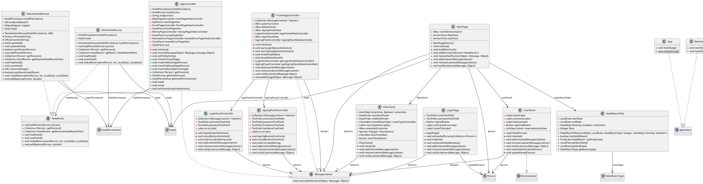

```plantuml
@startuml
class DirectHotelAccess {
    - HotelPersistence hotelPersistence
    - Hotel hotel

    + DirectHotelAccess(HotelPersistence hotelPersistence)
    + void addPerson(Person person)
    + Collection<Person> getPersons()
    + Collection<HotelRoom> getRoom  (HotelRoomFilter)
    + void loadHotel()
    + void saveHotel()
    + void makeReservation(Person, int, LocalDate, LocalDate)
}

class RemoteHotelAccess{
    - HotelPersistence hotelPersistence
    - URI endpointBaseUri
    - ObjectMapper mapper
    - Hotel hotel

    + RemoteHotelAccess(HotelPersistence, URI)
    - String uriParam(String)
    - URI personUri(String)
    - Hotel getHotel()
    + void updateHotel()
    - boolean putPerson(Person)
    + void addPerson(Person)
    + Collection<Person> getPersons()
    + Collection<HotelRoom> getRooms(HotelRoomFilter)
    + void loadHotel()
    + void saveHotel()
    - URI roomUri(Integer)
    - boolean putRoom(HotelRoom)
    + void makeReservation(Person, int, LocalDate, LocalDate)
    + void addBalance(Person, double) 
}

class App {
    + void start(Stage)
    + {static} void main(String[])
}

class RemoteApp{
    + void start(Stage) 
    + void main(String[])
}

class AppController {
    - HotelPersistence hotelPersistence
    - HotelAccess hotelAccess
    - String endpointUri
    - MainPageController mainPageViewControlle
    - SplitPane mainPageView
    - FrontPageController frontPageViewController
    - StackPane frontPageView
    - MoneyPageController moneyPageViewController
    - StackPane moneyPageView
    - RemoteErrorPageController remoteErrorPageViewController
    - StackPane remoteErrorPageView
    - StackPane root

    - void initialize()
    + void receiveMessage(Object, Message message,Object)
    + void setPrefix(String)
    + void moveToFrontPage()
    + void moveToMainPage(Person)
    + void moveToMoneyPage(Person)
    + void moveToRemoteErrorPage()
    + Collection<Person> getPersons()
    + HotelAccess getHotelAccess()
    + HotelPersistence getHotelPersistence()
    + void load()
    + void save()
    + void setHotelAccess(HotelAccess)
}

class FrontPageController{
    - Collection<MessageListener> listeners 
    - VBox panelContainer
    - VBox defaultPanel
    - VBox signUpPanelView
    - LoginPanelController loginPanelViewController
    - VBox loginPanelView
    - SignUpPanelController signUpPanelViewController

    - void initialize()
    - void startLoginButtonOnAction()
    - void startSignUpButtonOnAction() 
    - void showPanel(VBox)
    + void showDefaultPanel()
    + LoginPanelController getLoginPanelViewController()
    + SignUpPanelController getSignUpPanelViewController()
    + void addListener(MessageListener)
    + void removeListener(MessageListener)
    + void notifyListeners(Message,Object)
    + receiveMessage(Object, Message, Object)
}

class LoginPanelController{
    - Collection<MessageListener> listeners
    - TextField usernameTextField
    - TextField passwordTextField
    - Label errorLabel

    - void loginButtonOnAction() 
    - void cancelButtonOnAction()
    + void setErrorLabel(String text)
    + void addListener(MessageListener)
    + void removeListener(MessageListener)
    + void notifyListeners(Message, Object)
}

class SignUpPanelController{
    - Collection<MessageListener> listeners
    - TextField usernameTextField
    - TextField passwordTextField
    - TextField firstNameTextField
    - TextField lastNameTextField
    - Label errorLabel

    - void signUpButtonOnAction()
    - void cancelButtonOnAction()
    + void setErrorLabel(String)
    + void addListener(MessageListener)
    + void removeListener(MessageListener)
    + void notifyListeners(Message, Object)
}

enum Message {
    SignIn,
    SignOut,
    Filter
}

class FxmlUtils {
    + {static} void loadFxml
}

class LoginPage {
    - TextField nameTextField
    - TextField usernameTextField
    - Button signInButton
    - Label usernameErrorLabel
    - Label nameTitleLabel

    + loginPage()
    + void setLoadedPersons(Collection<Person>)
    - void initialize()
    - void setNameVisible(boolean)
    + void addListener(MessageListener)
    + void removeListener(MessageListener)
    + void notifyListeners(Message, Object)

}

class MainPage {
    - VBox roomItemContainer
    - AnchorPane filterPane
    - AnchorPane userPane
    + MainPage(Person)
    + void initialize()
    - void buildRoomList()
    + void addRooms(Collection<HotelRoom>)
    + void receiveNotification(Object, Message, Object)
    + void addListener(MessageListener)
    + void removeListener(MessageListener)
    + void notifyListeners(Message, Object)
}

class FilterPanel {
    - HashMap<Amenities, Boolean> amenities
    - DatePicker startDatePicker
    - DatePicker endDatePicker
    - ChoiceBox<HotelRoomType> roomTypeChoiceBox
    - Label roomTypeDescription
    - VBox amenitiesContainer
    - Spinner<Integer> floorSpinner
    - CheckBox floorCheckBox
    - Button clearFilterButton
    + FilterPanel()
    - void initialize()
    + void addListener(MessageListener)
    + void removeListener(MessageListener)
    + void notifyListeners(Message, Object)
}

class HotelRoomFilter {
    - LocalDate startDate
    - LocalDate endDate
    - HashMap<Amenity, boolean> amenities
    - Integer floor
    + HotelRoomFilter(LocalDate, LocalDate, HotelRoomType, Integer, HashMap<Amenity, boolean>)
    + boolean hasValidDates()
    + Predicate<HotelRoom> getPredicate()
    + LocalDate getStartDate()
    + LocalDate getEndDate()
    + HotelRoomType getRoomType()
}

class HotelRoomListItem {
    - Label numberLabel
    - Label typeLabel
    - Label amenitiesLabel
    - Button makeReservationButton
    + HotelRoomListItem(HotelRoom)
    - void initialize()
    + void setOnMakeReservationButtonAction()
}

class UserPanel {
    - Label nameLabel
    - Label usernameLabel
    - Label balanceLabel
    - Button signOutButton
    - ListView<Label> reservationListView
    + UserPanel(Person)
    - void initialize()
    + void addListener(MessageListener)
    + void removeListener(MessageListener)
    + void notifyListeners(Message, Object)
    + void receiveNotification(Person)
    - void updatePanel(Person)

}

interface HotelAccess {
    + void addPerson(Person person)
    + Collection<Person> getPersons()
    + Collection<HotelRoom> getRooms(HotelRoomFilter)
    + void loadHotel()
    + void saveHotel()
    + void makeReservation(Person, int, LocalDate, LocalDate)
    + void addBalance(Person, double)
}

interface MessageListener {
    void receiveNotification(Object, Message, Object)
}

interface PersonListener
interface Application
class Person
class HotelRoom
class Hotel
class HotelPersistence

AppController ..|> MessageListener
AppController --> "1" HotelPersistence : hotelPersistence
AppController --> "1" HotelAccess : hotelAccess

FrontPageController --> "1" LoginPanelController : loginPanelController
FrontPageController --> "1" SignUpPanelController : signUpPanelController
FrontPageController ..|> MessageListener
FrontPageController --> "n" MessageListener : listners

LoginPanelController --> "n" MessageListener : listners

SignUpPanelController --> "n" MessageListener : listners

LoginPage --> "n" MessageListener : listeners
LoginPage --> "n" Person : loadedPersons
MainPage --> "1" FilterPanel : filterPanel
MainPage --> "1" UserPanel : userPanel
MainPage --> "1" Hotel : hotel
MainPage --> "1" HotelRoomFilter : hotelRoomFilter
MainPage --> "1" Person : person
MainPage --> "n" MessageListener : listeners
FilterPanel --> "n" MessageListener : listeners
HotelRoomFilter --> "1" HotelRoomType : roomType
HotelRoomListItem --> "1" HotelRoom : room
UserPanel --> "n" MessageListener : listeners
UserPanel --> "1" Person : person
UserPanel ..|> PersonListener
RemoteApp ..|> Application
App ..|> Application
RemoteHotelAccess ..|> HotelAccess
RemoteHotelAccess --> "1" Hotel : hotel
RemoteHotelAccess --> "1" HotelPersistence : hotelPersistence
DirectHotelAccess ..|> HotelAccess
DirectHotelAccess -> "1" Hotel : hotel
DirectHotelAccess -> "1" HotelPersistence : hotelPersistence

@enduml
```