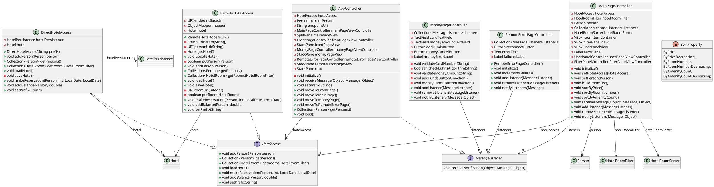

```plantuml
@startuml
class DirectHotelAccess {
    - HotelPersistence hotelPersistence
    - Hotel hotel

    + DirectHotelAccess(String prefix)
    + void addPerson(Person person)
    + Collection<Person> getPersons()
    + Collection<HotelRoom> getRoom  (HotelRoomFilter)
    + void loadHotel()
    - void saveHotel()
    + void makeReservation(Person, int, LocalDate, LocalDate)
    + void addBalance(Person, double)
    + void setPrefix(String)
}

class RemoteHotelAccess {
    - URI endpointBaseUri
    - ObjectMapper mapper
    - Hotel hotel

    + RemoteHotelAccess(URI)
    - String uriParam(String)
    - URI personUri(String)
    - Hotel getHotel()
    + void updateHotel()
    - boolean putPerson(Person)
    + void addPerson(Person)
    + Collection<Person> getPersons()
    + Collection<HotelRoom> getRooms(HotelRoomFilter)
    + void loadHotel()
    + void saveHotel()
    - URI roomUri(Integer)
    - boolean putRoom(HotelRoom)
    + void makeReservation(Person, int, LocalDate, LocalDate)
    + void addBalance(Person, double) 
    + void setPrefix(String)
}

class AppController {
    - HotelAccess hotelAccess
    - Person currentPerson
    - String endpointUri
    - MainPageController mainPageViewControlle
    - SplitPane mainPageView
    - FrontPageController frontPageViewController
    - StackPane frontPageView
    - MoneyPageController moneyPageViewController
    - StackPane moneyPageView
    - RemoteErrorPageController remoteErrorPageViewController
    - StackPane remoteErrorPageView
    - StackPane root

    - void initialize()
    + void receiveMessage(Object, Message, Object)
    + void setPrefix(String)
    + void moveToFrontPage()
    + void moveToMainPage()
    + void moveToMoneyPage()
    + void moveToRemoteErrorPage()
    + Collection<Person> getPersons()
    + void load()
}

class MainPageController {
    - HotelAccess hotelAccess
    - HotelRoomFilter hotelRoomFilter
    - Person person
    - Collection<MessageListener> listeners
    - HotelRoomSorter hotelRoomSorter
    - VBox roomItemContainer
    - VBox filterPanelView
    - VBox userPanelView
    - Label errorLabel
    - UserPanelController userPanelViewController
    - FilterPanelController filterPanelViewController

    - void initialize()
    + void setHotelAccess(HotelAccess)
    + void setPerson(Person)
    - void buildRoomList()
    - void sortByPrice()
    - void sortByRoomNumber() 
    - void sortByAmenityCount() 
    + void receiveMessage(Object, Message, Object)
    + void addListener(MessageListener)
    + void removeListener(MessageListener)
    + void notifyListeners(Message, Object) 
}

class MoneyPageController {
    - Collection<MessageListener> listeners
    - TextField cardTextField
    - TextField moneyAmountTextField
    - Button addFundsButton
    - Button moneyCancelButton
    - Label moneyErrorLabel

    - void validateCardNumber(String)
    - boolean checkLuhnsAlgorithm(String)
    - void validateMoneyAmount(String)
    - void addFundsButtonOnAction()
    - void moneyCancelButtonOnAction()
    + void addListener(MessageListener)
    + void removeListener(MessageListener)
    + void notifyListeners(Message,Object)
}

class RemoteErrorPageController {
    - Collection<MessageListener> listeners 
    - Button reconnectButton
    - Text errorText
    - Label failuresLabel

    + RemoteErrorPageController()
    + void initialize()
    + void incrementFailures()
    + void addListener(MessageListener)
    + void removeListener(MessageListener)
    + void notifyListeners(Message)
}

enum SortProperty {
    ByPrice,
    ByPriceDecreasing,
    ByRoomNumber,
    ByRoomNumberDecreasing,
    ByAmenityCount,
    ByAmenityCountDecreasing;
}

interface HotelAccess {
    + void addPerson(Person person)
    + Collection<Person> getPersons()
    + Collection<HotelRoom> getRooms(HotelRoomFilter)
    + void loadHotel()
    + void makeReservation(Person, int, LocalDate, LocalDate)
    + void addBalance(Person, double)
    + void setPrefix(String)
}

interface MessageListener {
    void receiveNotification(Object, Message, Object)
}

class Hotel
class HotelPersistence
class Person
class HotelRoomFilter

AppController ..|> MessageListener
AppController --> "1" HotelAccess : hotelAccess

RemoteHotelAccess ..|> HotelAccess
RemoteHotelAccess --> "1" Hotel : hotel
DirectHotelAccess ..|> HotelAccess
DirectHotelAccess -> "1" Hotel : hotel
DirectHotelAccess -> "1" HotelPersistence : hotelPersistence

MainPageController --> "1" HotelAccess : hotelAccess
MainPageController --> "1" HotelRoomFilter : hotelRoomFilter
MainPageController --> "1" Person : person
MainPageController --> "n" MessageListener : listeners
MainPageController --> "1" HotelRoomSorter : hotelRoomSorter

MoneyPageController --> "n" MessageListener : listeners

RemoteErrorPageController --> "n" MessageListener : listeners

@enduml
```
