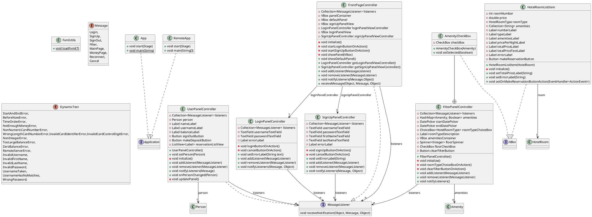

```plantuml
@startuml

class App {
    + void start(Stage)
    + {static} void main(String)
}

class RemoteApp {
    + void start(Stage) 
    + void main(String[])
}

class FrontPageController {
    - Collection<MessageListener> listeners 
    - VBox panelContainer
    - VBox defaultPanel
    - VBox signUpPanelView
    - LoginPanelController loginPanelViewController
    - VBox loginPanelView
    - SignUpPanelController signUpPanelViewController

    - void initialize()
    - void startLoginButtonOnAction()
    - void startSignUpButtonOnAction() 
    - void showPanel(VBox)
    + void showDefaultPanel()
    + LoginPanelController getLoginPanelViewController()
    + SignUpPanelController getSignUpPanelViewController()
    + void addListener(MessageListener)
    + void removeListener(MessageListener)
    + void notifyListeners(Message,Object)
    + receiveMessage(Object, Message, Object)
}

class LoginPanelController {
    - Collection<MessageListener> listeners
    - TextField usernameTextField
    - TextField passwordTextField
    - Label errorLabel

    - void loginButtonOnAction() 
    - void cancelButtonOnAction()
    + void setErrorLabel(String text)
    + void addListener(MessageListener)
    + void removeListener(MessageListener)
    + void notifyListeners(Message, Object)
}

class SignUpPanelController {
    - Collection<MessageListener> listeners
    - TextField usernameTextField
    - TextField passwordTextField
    - TextField firstNameTextField
    - TextField lastNameTextField
    - Label errorLabel

    - void signUpButtonOnAction()
    - void cancelButtonOnAction()
    + void setErrorLabel(String)
    + void addListener(MessageListener)
    + void removeListener(MessageListener)
    + void notifyListeners(Message, Object)
}

class FilterPanelController {
    - Collection<MessageListener> listeners
    - HashMap<Amenity, Boolean> amenities
    - DatePicker startDatePicker
    - DatePicker endDatePicker
    - ChoiceBox<HotelRoomType> roomTypeChoiceBox
    - Label roomTypeDescription
    - VBox amenitiesContainer
    - Spinner<Integer> floorSpinner
    - CheckBox floorCheckBox
    - Button clearFilterButton

    + FilterPanelController()
    - void initialize()
    - void roomTypeChoiceBoxOnAction()
    - void clearFilterButtonOnAction()
    + void addListener(MessageListener)
    + void removeListener(MessageListener)
    + void notifyListeners()
    }

class AmenityCheckBox {
    - CheckBox checkBox 
    
    + AmenityCheckBox(Amenity)
    + void setSelected(boolean)
}

class HotelRoomListItem {
    - int roomNumber
    - double price
    - HotelRoomType roomType
    - Collection<String> amenities
    - Label numberLabel
    - Label typeLabel
    - Label amenitiesLabel
    - Label pricePerNightLabel
    - Label totalPriceLabel
    - Label totalPriceTextLabel
    - Label errorLabel
    - Button makeReservationButton

    + HotelRoomListItem(HotelRoom)
    - void initialize() 
    + void setTotalPriceLabel(String)
    + void setErrorLabel(String)
    + void setOnMakeReservationButtonAction(EventHandler<ActionEvent>)
}

class UserPanelController {
    - Collection<MessageListener> listeners
    - Person person
    - Label nameLabel
    - Label usernameLabel
    - Label balanceLabel
    - Button signOutButton
    - Button makeDepositButton
    - ListView<Label> reservationListView

    + UserPanelController() 
    + void setPerson(Person)
    - void initialize()
    + void addListener(MessageListener)
    + void removeListener(MessageListener)
    + void notifyListeners(Message)
    + void onPersonChanged(Person)
    - void updatePanel()
}

class FxmlUtils {
    + {static} void loadFxml(T)
}

enum Message {
    Login,
    SignUp,
    SignOut,
    Filter,
    MainPage,
    MoneyPage,
    Reconnect,
    Cancel
}

enum DynamicText {
    StartAndEndError,
    BeforeNowError,
    TimeOrderError,
    NotEnoughMoneyError,
    NonNumericCardNumberError,
    WrongLengthCardNumberError,InvalidCardIdentifierError,InvalidCardControlDigitError,
    NonIntegerError,
    TooLargeBalanceError,
    ZeroBalanceError,
    RemoteServerError,
    InvalidUsername,
    InvalidFirstName,
    InvalidLastName,
    InvalidPassword,
    UsernameTaken,
    UsernameHasNoMatches,
    WrongPassword;
}

interface MessageListener {
    void receiveNotification(Object, Message, Object)
}

interface Application
interface HBox
class Person
class HotelRoom
class Amenity

RemoteApp ..|> Application
App ..|> Application

FrontPageController --> "1" LoginPanelController : loginPanelController
FrontPageController --> "1" SignUpPanelController : signUpPanelController
FrontPageController ..|> MessageListener
FrontPageController --> "n" MessageListener : listeners

LoginPanelController --> "n" MessageListener : listeners

SignUpPanelController --> "n" MessageListener : listeners

FilterPanelController --> "n" MessageListener : listeners
FilterPanelController --> "n" Amenity : amenities

AmenityCheckBox --+ FilterPanelController
AmenityCheckBox ..|> HBox

HotelRoomListItem --> "1" HotelRoom : room
HotelRoomListItem ..|> HBox

UserPanelController  --> "n" MessageListener : listeners
UserPanelController --> "1" Person : person
UserPanelController ..|> MessageListener

@enduml
```