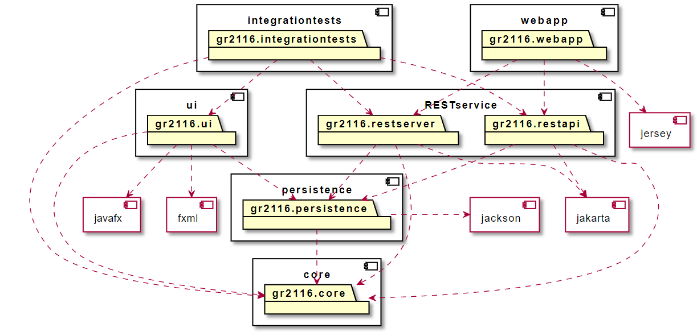

# Pakkediagram
Prosjektet inneholder flere moduler, disse beskrives i [modules](../modules/README.md)

I denne mappen ligger det en markdown-fil, som inneholder kode for å
generere pakkediagram med PlantUML. Diagrammet viser statistke relasjoner mellom mmodulene.
Pakkediagramet kan man finnes under [images](../images).

## Bildet av pakkediagram

