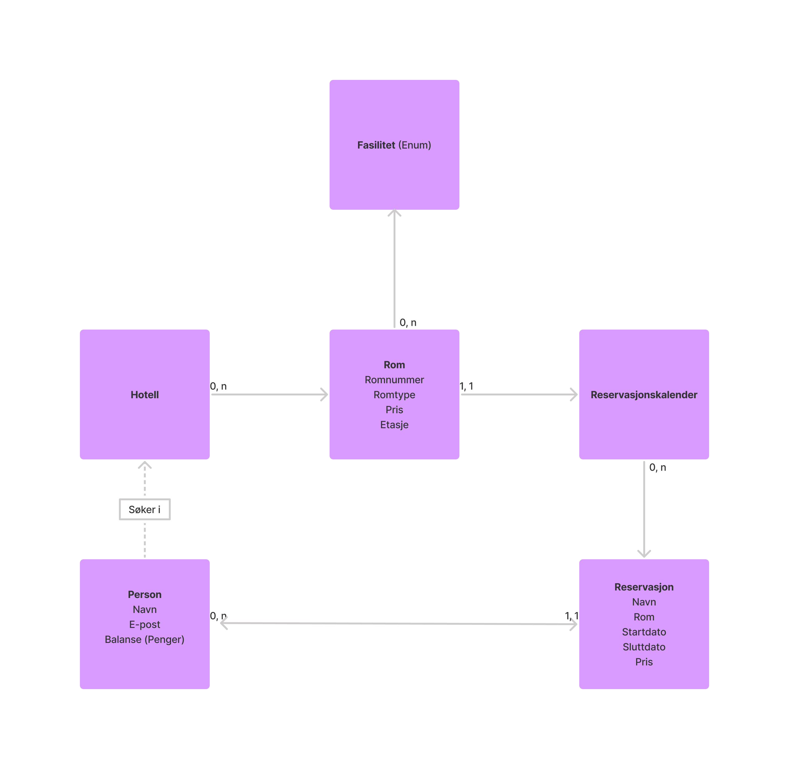
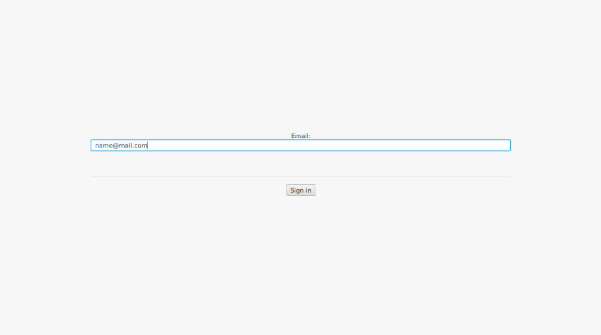
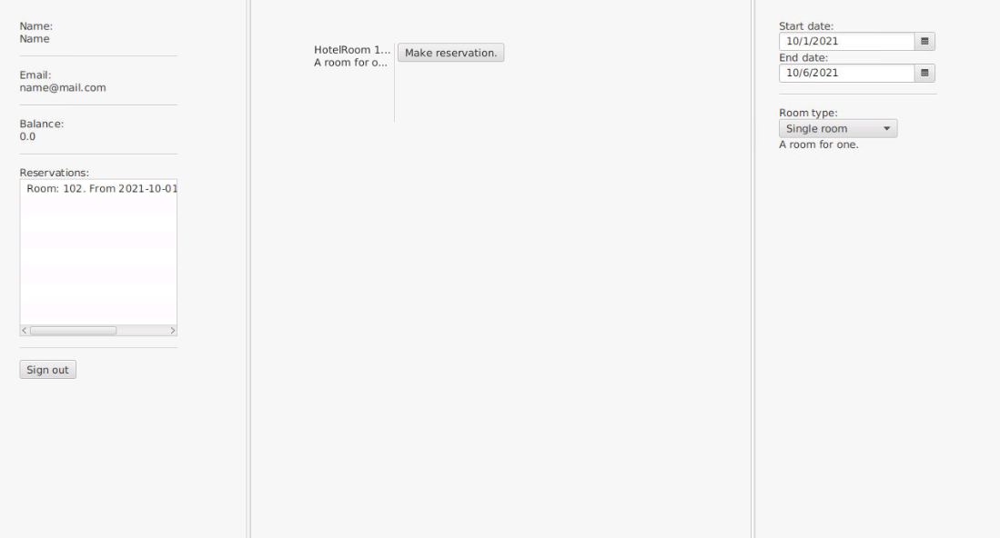

Issuses på [GitLab](https://gitlab.stud.idi.ntnu.no/it1901/groups-2021/gr2116/gr2116) for innlevering 1 kan finnes under milestone [Release 1 - MVP](https://gitlab.stud.idi.ntnu.no/it1901/groups-2021/gr2116/gr2116/-/milestones/1).

Designet til først innlevering legges på bakgrunn av brukerhistorien:

## ER-diagram

Et Entity Relationship Diagram vises under, det angitt konseptuelle sammenhenger mellom klassene. 
Et hotell kan ha mange rom. Rommet kan ha mange fasiliteter, men kun en reservasjonskalender. Reservasjonskalenderen kan ha mange reservasjoner. En reservasjon er koblet til en person, mens en persjon kan ha mange reservasjoner. Personen søker i hotell for å finne ledige rom med riktige fasiliteter. 

## Skjermbilder

Under vises skjermbilder for hvordan applikasjonen ser ut foreløpig. Innloggingsiden er for å logge inn eller opprette ny bruker. Hovedsiden er der brukeren søker etter hotellrom og oppretter reservasjoner.

## Realisert

Når appen åpnes kommer det opp et innloggingsvindu. Her skriver man inn e-postadresse. E-postadressen må være gyldig for at man skal komme seg videre. Dersom e-postadressen er brukt tidligere kommer man direkte videre, eller så må man skrive inn navn også. Når man trykker "Sign in"  ser man på venstre side navn, e-postadresse, saldo og reservasjoner. Midten er tom, fram til du velger dato for inn og utsjekking, samt hvilken romtype du vil ha. Merk at det ikke er mulig å filtrere basert på fasiliteter i denne utgivelsen. Da vil rom som er ledig i denne perioden og som har denne romtypen dukke opp på skjermen. Om bruker har gjort enn feil, vil det komme en forklarende feilmelding, slik at bruker kan rette opp feilen. I tillegg er det implentert fillagring, slik at reservasjoner brukeren gjør lagres i en fil. Denne filen kan lagres, og leses ved senere bruk av appen. Dersom man logger seg inn med samme mail, vil man kunne se reservasjoner som er gjort tidligere.
