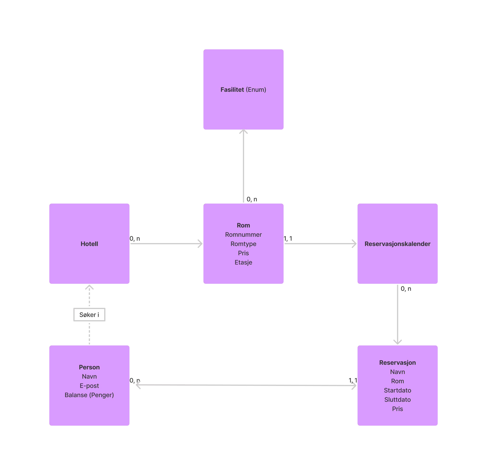
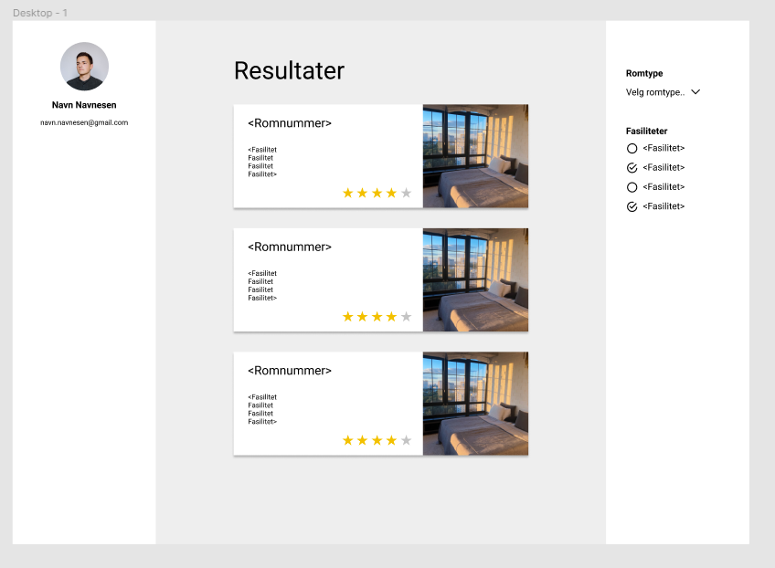

 release-mappene er ment for å dekke hva slags funksjonalitet som (er ment å være) med, mens generell dokumentasjon av prosjektet ligger i md-filer utenom release-mappene og endres jevnt og trutt gjennom semesteret for å speile realitetene

  For hver sluppet versjon skal en beskrive hvilken funksjonalitet en vil ha med, f.eks. i form av brukerhistorier og designskisser. Så slipper dere en versjon når det er realisert, heller enn å fryse tidsfristen og slippe det dere har da.

Designet til først innleverinig legges på bakgrunn av brukerhistorien:

## Brukerhistorie
### Booking av hotelrom 

> Som privatperson ønsker jeg å finne hotellrom som har de fasilitetene jeg vil ha, slik at jeg får et godt opphold. 
> _- Bruker_

Brukeren har behov for å kunne velge hvilke fasiliteter de vil at hotellrommet skal ha, og deretter kunne se de ledige rommene som passer best til de valgte fasilitetene. Det bør kunne velges hvilken periode brukeren vil reservere rom for, og deretter kunne se hvilke rom brukeren har reservert. Dermed er det lett å huske hvilke rom brukeren har reservert. 

## ER-diagram

Et Entity Relationship Diagram vises under, det angit en konseptsuelle sammenhenger mellom klassene. 
Et hotell kan ha mange rom. Rommet kan ha mange fasiliteter, men kun en reservasjonskalender. Reservasjonskalenderen kan ha mange reservasjoner. En reservasjon er koblet til en person, mens en persjon kan ha mange reservasjoner. Personen søker i hotell for å finne ledige rom med riktige fasiliteter. 

## Designskisse

Under vises en skisse av hvordan appen skal se ut for brukeren. Brukeren kan velge fasiliteter og romtype, og får dermed opp rom som passer denne beskrivelsen.

