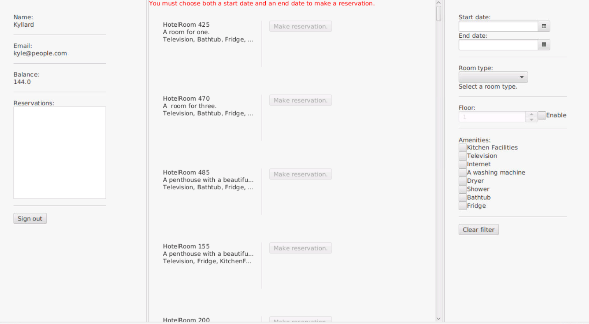

Issues for innlevering 2 kan finnes under milestone [Release 2](https://gitlab.stud.idi.ntnu.no/it1901/groups-2021/gr2116/gr2116/-/milestones/2).

## Arkitektur 

Klassediagram for alle modulene er generert med PlantUML, og kan sees i [modules](../modules/README.md). I tilegg ligger alle diagrammene i [images](../images). 

## Arbeidsvaner

Vi jobber fire timer sammen på skolen, og fordeler oppgaver innad. Dersom det er noen problemer tar vi kontakt digitalt. Når vi sitter fysisk på skolen bruker vi parprogrammering ved behov. Koden skrevet av enkeltperson blir gått gjennom av andre gruppemedlemmer, for best mulig Kodekvalitet.

## Kodekvalitet

Det er flere tester for alle de tre lagene. Jacoco brukes til å se testdekningsgrad, Maven-tillegget CheckStyle benyttes for å forsikre seg om at koden opprettholder kodingsstandard og SpotBugs benytter til å finne bugs i koden. I tillegg benyttes Mockito i de ulike testene i core, slik at klassene kan testes uavhengig av hverandre

## Skjermbilde

Under vises et skjermbilde for hvordan hovedsiden ser ut foreløpig. Innloggingsiden er lik som den var i [innlevering 1](../release1/README.md). 

## Realisert

Appen er i stor grad lik som ved innlevering 1 [(se release1)](../release1/README.md). Noen endringer er gjort i hovedsiden. Nå kan man velge etasje og fasilteter. Dermed er det letter for bruker å finne ønskelig rom, samt at det oppfyller [brukerhistriere 2](../../brukerhistorie.md). Det er også mulig å fjerne valgte filter, slik at brukeren lett kan nullstille alle valg.