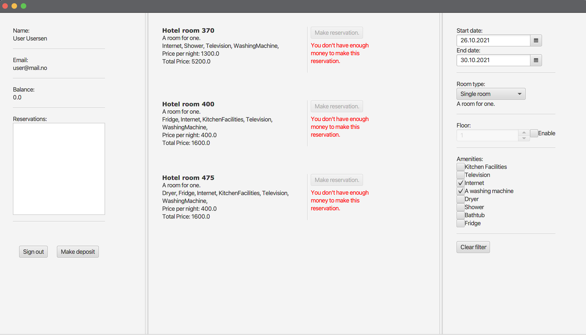
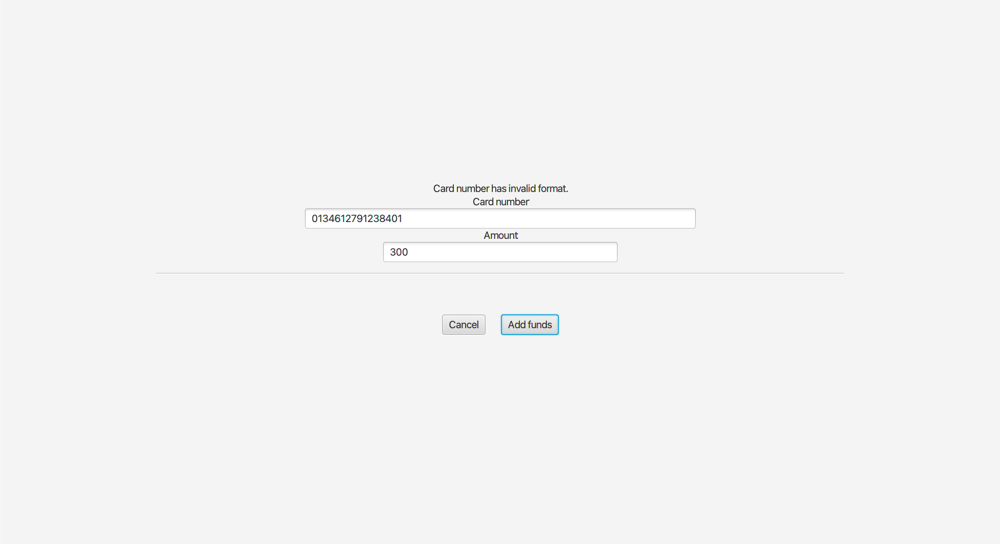

# Release 2

Issues for innlevering 2 kan finnes under milestone [Release 2](https://gitlab.stud.idi.ntnu.no/it1901/groups-2021/gr2116/gr2116/-/milestones/2).

## Arkitektur 

Klassediagram for alle modulene er generert med PlantUML, og kan ses i [modules](../modules/README.md). I tillegg ligger alle diagrammene i [images](../images). 

## Arbeidsvaner

Vi jobber mellom fire og åtte timer i uken sammen på skolen, og fordeler resterende oppgaver mellom oss. Dersom det er noen problemer med å gjennomføre oppgaver individuelt tar vi kontakt med hverandre digitalt. Når vi sitter fysisk på skolen bruker vi parprogrammering ved behov. Koden skrevet av enkeltpersoner blir gått gjennom av andre gruppemedlemmer, slik at alle vet hvordan funksjoner blir implementert. I tillegg sørger dette for at feil blir oppdaget.

## Kodekvalitet

Det er tester for alle de tre lagene. Jacoco brukes til å sjekke testdekningsgrad, Maven-tillegget CheckStyle benyttes for å forsikre at koden er leselig og SpotBugs benyttes til å finne bugs i koden. I tillegg benyttes Mockito i de ulike testene i core, slik at klassene kan testes uavhengig av hverandre.

## Skjermbilder

Under vises et skjermbilde for hvordan hovedsiden ser ut foreløpig. 

Under vises et skjermbilden av siden for å legge inn penger. Kortnummer må være gyldig for at penger skal kunne settes inn, se eget avsnitt.

Innloggingsiden er lik som den var i [innlevering 1](../release1/README.md).

## Realisert

Appen bygger på konseptene fra den første innleveringen. [(Se release1)](../release1/README.md). Noen endringer er gjort i hovedsiden. Nå kan man velge etasje og fasilteter. Det er lettere for brukeren å finne ønskelig rom, samt at funksjonaliteten i [brukerhistorie 1](../../brukerhistorie.md) innfris. Det har blitt mulig å fjerne valgte filter, slik at brukeren lett kan nullstille valgene. Rom har fått pris, som beregnes ut i fra antall valgte netter. For å legge til penger på sin konto kan man trykke på 'Velg Deposit'.

## Kortnummer

På siden for å legge inn penger på kontoen sin, må man skrive inn et gyldig kortnummer. Et gyldig kortnummer oppfyller følgende krav:
* De første 4 sifrene betegner et land, og er mellom 0001 og 0195.
* De neste 8 sifrene kan være hva som helst.
* De siste 4 sifrene skal være et firesifret tall x, som tilfredstiller x mod 13 ≡ 9.

Under følger noen fungerende kortnummer for testing:
* 0035 1396 2714 1322
* 0079 2412 4162 2713
* 0001 0000 0000 0009
