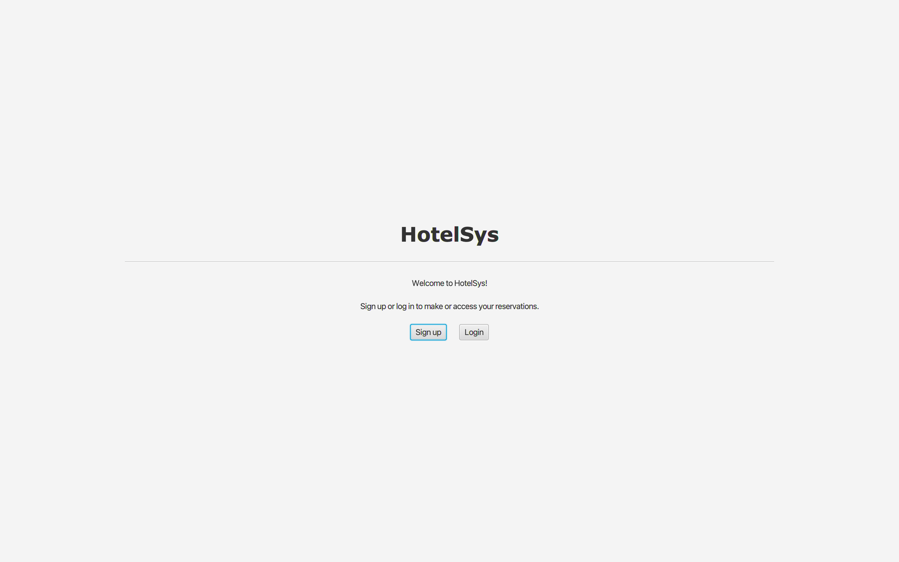
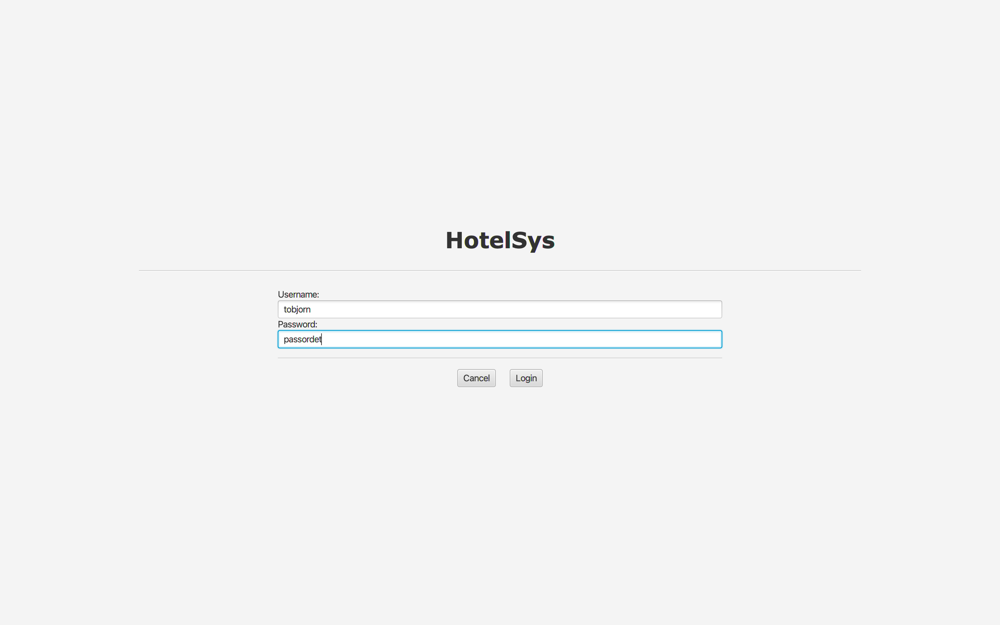
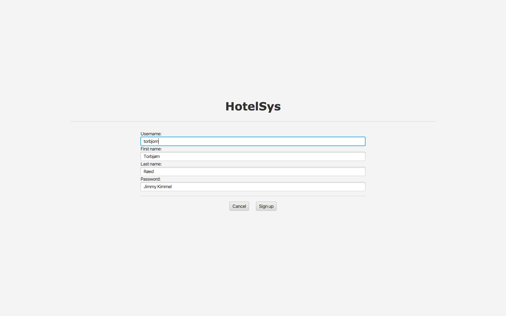
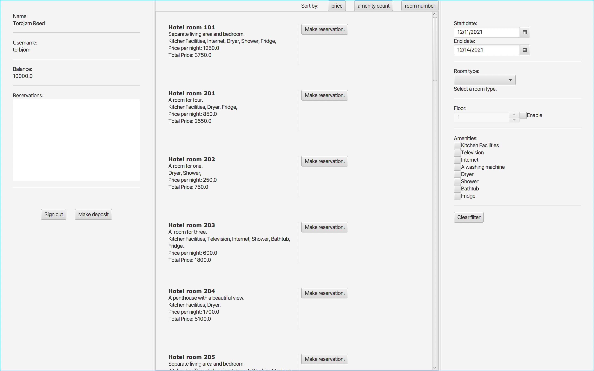
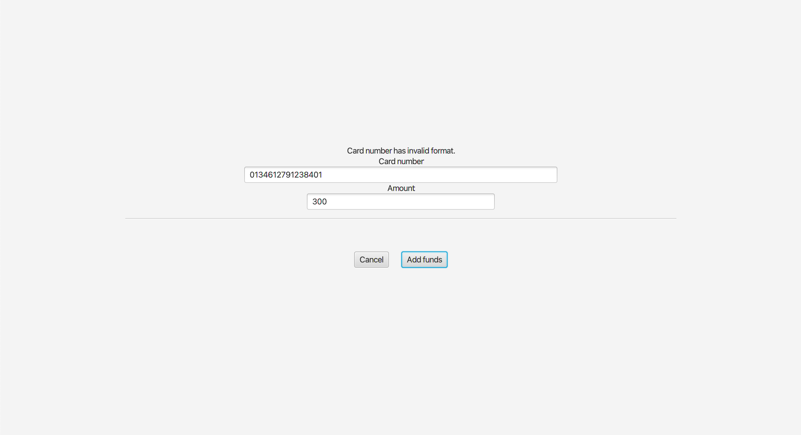

# Release 3

Issues for innlevering 3 kan finnes under milestone [Release 3](https://gitlab.stud.idi.ntnu.no/it1901/groups-2021/gr2116/gr2116/-/milestones/3).

## Arkitektur 

Klassediagram for alle modulene er generert med PlantUML, og kan ses i [modules](../modules/README.md). I tillegg ligger alle diagrammene i [images](../images).

## Arbeidsvaner

Vi jobber mellom åtte og tolv timer i uken sammen på skolen, og fordeler resterende oppgaver mellom oss. Dersom det er noen problemer med å gjennomføre oppgaver individuelt tar vi kontakt med hverandre digitalt. Når vi sitter fysisk på skolen bruker vi parprogrammering ved behov. Koden skrevet av enkeltpersoner blir gått gjennom av andre gruppemedlemmer, slik at alle vet hvordan funksjoner blir implementert. I tillegg sørger dette for at feil blir oppdaget. Vi opplever at vi har god effektivitet og at den tekniske kvaliteten på prosjektet er høy.

## Kodekvalitet

Det er tester for alle de tre lagene. Jacoco brukes til å sjekke testdekningsgrad, Maven-tillegget CheckStyle benyttes for å forsikre at koden er leselig og SpotBugs benyttes til å finne bugs i koden. Mockito brukes i testmodulene, slik at klassene kan testes uavhengig av hverandre. Det er satt opp en git-'hook', som sørger for at alle commits har med issue-nummer. Denne ble lagt til sent i prosjektet, og fungerer kun når man arbeider lokalt (ikke i nettleser).

## Skjermbilder

Startsiden:

Siden for å logge inn:

Siden for å registrere seg:

Så, et bilde av hvordan hovedsiden ser ut.

Skjermbilde av siden for å legge inn penger. Kortnummer må være gyldig for at penger skal kunne settes inn, se eget avsnitt.

## Realisert

Appen bygger på konseptene fra den første og den andre innleveringen. Se [release1](../release1/README.md) og [(release2)](../release2/README.md). Nytt i den tredje utgivelsen er at appen er rigget opp med et REST API. Når man reserverer rom eller lager brukerkonto blir dette nå lagret på en server. Dermed kan man i teorien benytte appen hvor som helst, enn om det er hjemme, fra jobb eller på hotellet. Istedenfor e-post registrerer man seg nå med et brukernavn, og man lager et passord som man senere må bruke for å kunne logge inn. Brukernavnet må oppfylle krav, som nevnt under. Passordet blir hashet; det blir aldri lagret på serveren i klartekst. Vi har også realisert funksjonalitet som tillater å sortere hotellrom etter pris, romnummer og antallet fasiliteter på et rom.

## Brukernavn

Brukernavn må utelukkende bestå av bokstaver, store eller små.

## Passord

Passord må ha 6 eller flere tegn.

## Fornavn og etternavn

Alle navn er gyldige. Grunnen til at vi har gjort det slik er at det finnes [svært mange ulike navnekonvensjoner](https://www.kalzumeus.com/2010/06/17/falsehoods-programmers-believe-about-names/).

## Kortnummer

På siden for å legge inn penger på kontoen sin, må man skrive inn et gyldig kortnummer. Et gyldig kortnummer oppfyller følgende krav:
* Kortnummeret er 16 siffer langt.
* De første sifferne betegner utsteder, og må være enten 4 (Visa) eller 51-55 / 2221-2720 (Mastercard).
* Det siste sifferet må tilfredstille [Luhns' algoritme](https://en.wikipedia.org/wiki/Luhn_algorithm).

Under følger noen fungerende (men falske) kortnummer for testing:
* 4106 5778 3149 6288
* 5172 3119 4781 6718

