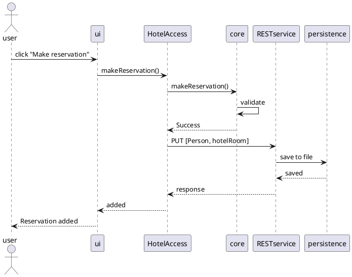

```plantuml
@startuml

    actor user

    user -> ui: click "Make reservation"
    ui -> HotelAccess: makeReservation()
    HotelAccess -> core: makeReservation()
    core -> core: validate
    HotelAccess <-- core: Success
    HotelAccess -> RESTservice: PUT [Person, hotelRoom]
    RESTservice -> persistence: save to file

    RESTservice <-- persistence: saved
    HotelAccess <-- RESTservice: response
    ui <-- HotelAccess: added
    user <-- ui: Reservation added

@enduml
```
