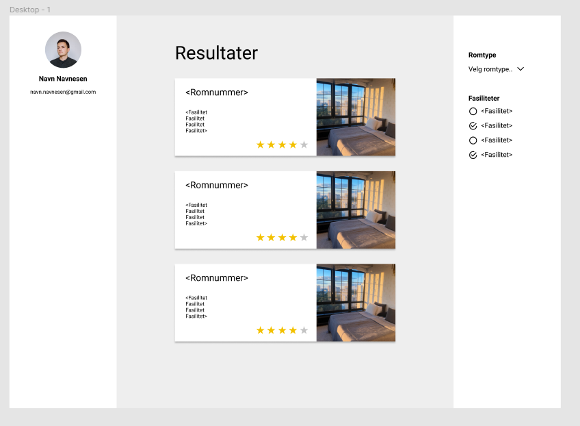

# HotelSys
HotelSys er et program hvor man kan reservere hotellrom for bestemte tidspunkt, og søke på ledige rom basert på fasiliteter og romtype. Programmet støtter innlogging med flere brukere, og fra innloggingsskjermen kan man selv opprette en ny brukerkonto hvis man ikke allerede er registrert. Et rom kan kun reserveres for gitte datoer dersom det er ledig i hele den valgte perioden. Brukerne får ikke vite hvem som har reservert rommet, slik at personvern blir ivaretatt. Brukere har en saldo, som kan brukes til å betale for hotellrom. Man kan kun reservere hotellrom dersom man har nok penger.

Programmet skal også støtte et administratorpanel. Der kan man legge til nye hotellrom, se reservasjoner og endre brukeres saldo.

Alle disse funksjonene er ikke realisert. I [dokumentasjonen](../docs/release2/README.md) finnes en oversikt over hva som er implementert.

## Designskisse

