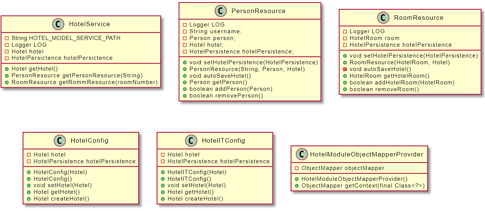

# RESTservice-modul

Denne modulen inneholder kode for REST-api og kode for REST-server. Modulen bestemmer hvordan ulike forespørsler skal bli behandlet.

## Database

I dokumentasjonen her skriver vi database, dette stemmer delvis, men vår service ([`HotelService.java`](src/main/java/gr2116/RESTservice/restapi/HotelService.java)) skriver og leser direkte fra en fil som vil ligge lagret på brukerens maskin. Dette fordi den bruker [`HotelPersistence.java`](/gr2116-project/persistence/src/main/java/gr2116/persistence/HotelPersistence.java) som lagrer direkte til:

> ~/HotelSys/dataHotel.json

## API

Vi har bygget et REST-API som støtter følgende forespørsler:

* `GET /hotel`: Hente ut hele hotellobjektet fra databasen.
* `GET /hotel/person/{brukernavn}`: Henter ut person {brukernavn} fra databasen.
* `PUT /hotel/person/{brukernavn}` med JSON for personobjektet: Legger til personen til hotellobjektet i databasen.
* `DELETE /hotel/person/{brukernavn}`: Sletter personen fra databasen.
* `GET /hotel/rooms/{romnummer}`: Henter ut rommet {romnummer} fra databasen.
* `PUT /hotel/rooms/{romnummer}` med JSON for romobjektet: Legger til rommet til hotellobjektet i databasen.
* `DELETE /hotel/rooms/{romnummer}`: Sletter rommet fra databasen.

DELETE-metodene brukes ikke i applikasjonen. Som nevnt i [release 3](../../docs/release3/README.md) fikk vi ikke tid til å implementere administratorpanel, hvor dette ville blitt brukt. De andre metodene brukes derimot i applikasjonen. Likevel er det dokumentert i [release 3](../../docs/release3/README.md) hvordan man kan bruke verktøyet [cURL](https://curl.se) til å bruke PUT og DELETE i kommandolinjen for å legge til eller slette rom/personer.

## Oppbygging

RESTservice består av to pakker (gr2116.RESTservice):

* [`restapi`](src/main/java/gr2116/RESTservice/restapi)
* [`restserver`](src/main/java/gr2116/RESTservice/restserver)

Restserver inneholder konfigurasjon for hvordan json som blir sendt med HTTP-requester skal bli mappet til objekter, og inneholder Hotel-objektet.

Restapi får Hotel-objektet fra restserver gjennom Context-tag. [`HotelService.java`](src/main/java/gr2116/RESTservice/restapi/HotelService.java) tar imot forespørsler til baseURL/rest/hotel/*, og avhengig av hva resten av URL er, vil den delegere videre til enten [`RoomResource.java`](src/main/java/gr2116/RESTservice/restapi/RoomResource.java) eller [`PersonResource.java`](src/main/java/gr2116/RESTservice/restapi/PersonResource.java).

## Testdekning

Testdekningen for RESTservice-modulen er noe lavere enn for de andre modulene. Dette skyldes at funksjonaliteten testes i integrationtests. Vi anser det ikke som nyttig å teste samme funksjonalitet to ganger.

## Klassediagram

Under følger klassediagrammet for `RESTservice`-modulen.

