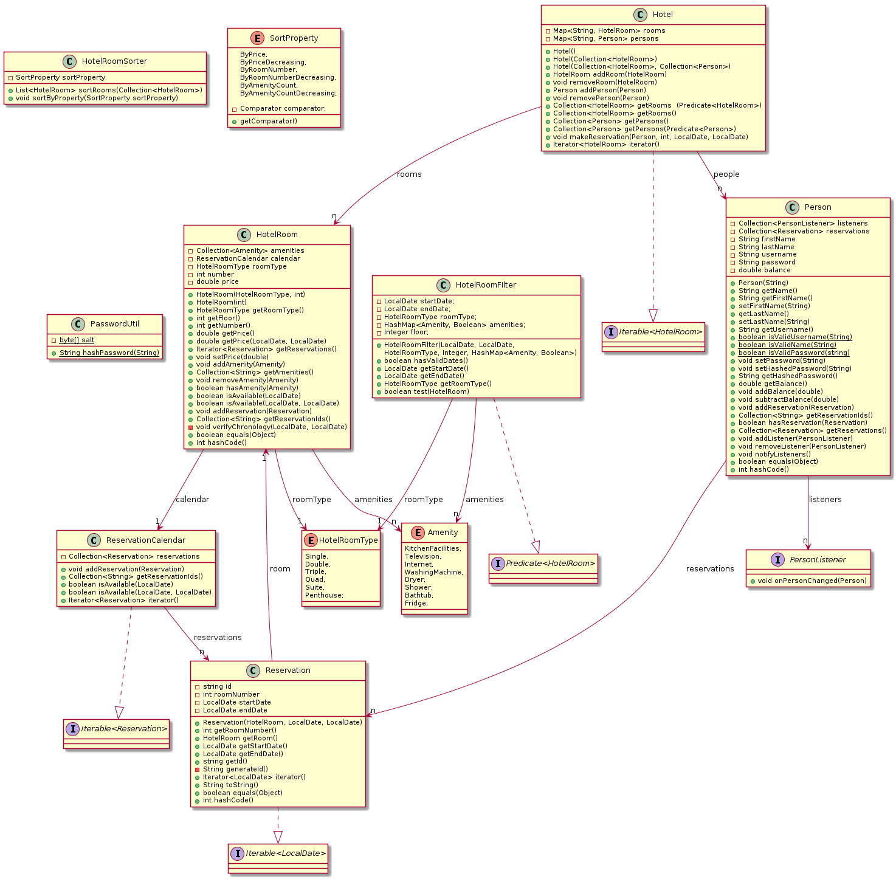

# Core-modul

Denne modulen inneholder kode for modellen i applikasjonen. Her utføres kjernelogikken for reserverasjon av rom og innlogging.

Klassene i Core-modulen er `Person`, `HotelRoom`, `Hotel`, `HotelRoomFilter`, `HotelRoomType`, `HotelRoomSorter`
`PasswordUtil`, `PersonListener`, `Reservation`, `ReservationCalendar` og `Amenity`.

## Oppbygging

Et `Hotel`-objekt inneholder en tabell med personer og en tabell med rom. `Person`-objektet har metoder og felt som brukes for innlogging og romreservasjon. `HotelRoom`-objekter har metoder og felt som beskriver rommets fasiliteter og type, og som lagrer reservasjonene tilhørende rommet. Core-modulen tilbyr et API for å sjekke om rom er ledige, for å lage nye brukere, for å opprette og administrere romreservasjoner, sortere og filtrere rom og sette inn/bruke penger. De ulike fasilitetene og romtypene er beskrevet under.

## Amenity

Det er 8 fasiliteter som kan være på hotellrom:
* Kitchen Facilities
* Television
* Internet
* Washing Machine
* Dryer
* Shower
* Bathtub
* Fridge

## HotelRoomType

Hotellrom finnes i følgende varianter:
* Single
* Double
* Triple
* Quad
* Suite
* Penthouse

## Klassediagram

Under følger klassediagrammet for `core`-modulen.

