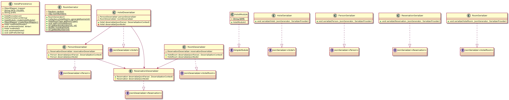

# Persistence-modul

Denne modulen inneholder kode for fil-lagring og lasting, og brukes til serialisering, romgenerering og til å lagre/laste data lokalt og på serveren.

## Oppbygging 

Modulen inneholder klassene [`HotelPersistence`](src/main/java/gr2116/persistence/HotelPersistence.java), for fil-lagring og lasting, og [`RoomGenerator`](src/main/java/gr216/persistence/RoomGenerator.java), for genering av rom.
I tillegg inneholder modulen pakken [`internal`](src/main/java/gr2116/persistence/internal). Her ligger det kode for
serialisering og deserialisering.

## Klassediagram

Under følger klassediagrammet for `persistence`-modulen.

