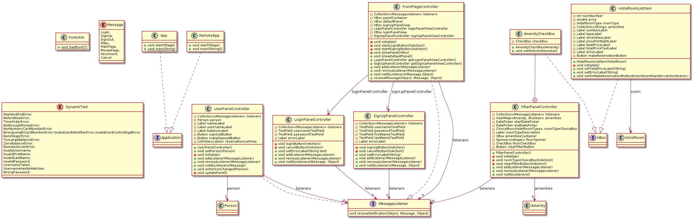

# UI-modul

Denne modulen inneholder kode for det grafiske brukergrensesnittet i applikasjonen.

## Testdekning

UI-modulen mangler testdekning i jacoco for access-pakken, app-pakken og remoteerror-pakken. Dette skyldes at klassene i disse pakkene testes i integrationtests. Vi anser det ikke som nyttig å teste disse to ganger.

## klassediagram

Klassediagram for UI-modul er delt i to, slik at det blir mer oversiktelig.

